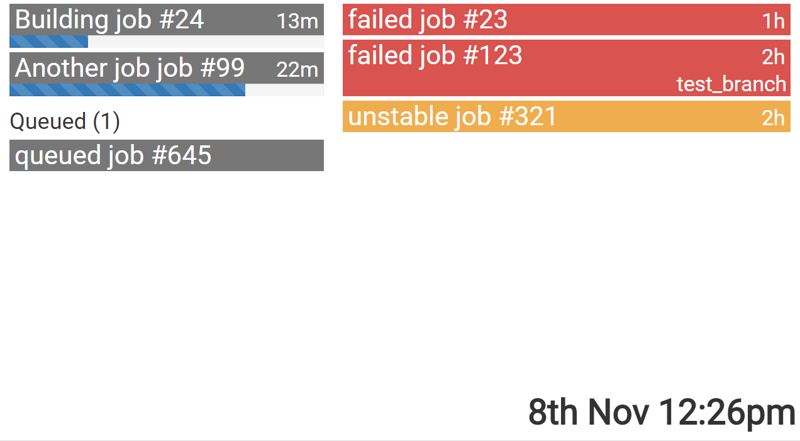

#Jenkins Dashboard

Simple status dashboard for showing jenkins build information.

Shows building, queued and failed jobs.

Also cycles though images when there are no failed builds (image urls are stored in firebase)

##Install

- Check out to you jenkins server
- Create a config.js file in the js directory (see config-example.js)
- No npm or bower required, all external dependencies loaded from CDNs

##Example

